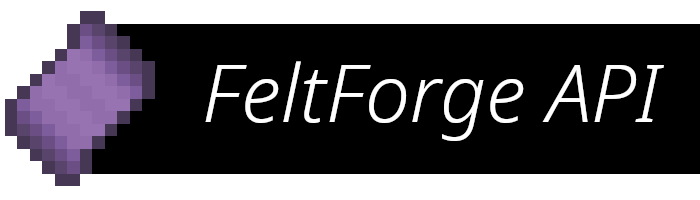

FeltForge
============= 

FeltForge is a reimplementation of a free, open-source modding API, on Fabric Loader!

# Installing FeltForge

Go to [the FeltForge CurseForge page](https://curseforge.com/placeholder), select the minecraft version, and add to your Fabric mods folder!
 
For support and questions, visit [the FeltMC Discord server](https://discord.feltmc.net/).

#### Donate
[Buy us a coffee?](https://www.buymeacoffee.com/feltmc/)
