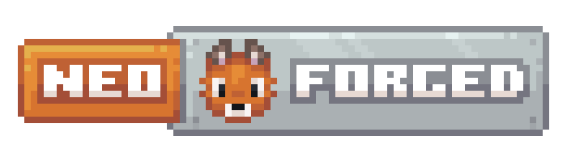

NeoForge
=============

NeoForge is a free, open-source, community-oriented modding API for Minecraft.

| Version | Support |
|---------|---------|
| 26.2.x  | Active  |

## Contribute to NeoForge

If you wish to actually inspect NeoForge, submit PRs or otherwise work
with NeoForge itself, you're in the right place!

Check the [contribution workflow][Contributing] for details.

### Pull requests

Please read the contributing guidelines found [here][Contributing] before making a pull request.

### Contributor License Agreement
We require all contributors to acknowledge the [NeoForged Contributor License Agreement][CLA]. 
Please ensure you have a valid email address associated with your GitHub account to do this. If you have previously 
 signed it, you should be OK.

[CLA]: https://cla-assistant.io/neoforged/NeoForge
[Contributing]: ../docs/CONTRIBUTING.md
