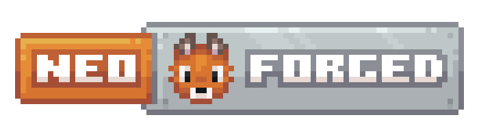

NeoForge
=============
[][Discord] 

NeoForge is a free, open-source, community-oriented modding API for Minecraft.

| Version | Support |
|---------|---------|
| 1.20.x  | Active  |

* [Download]
* [Discord]
* [Documentation]

## Installing NeoForge

Go to the [Download] page, select the Minecraft version and installer, and run it.
The installer will attempt to install NeoForge into your vanilla launcher environment,
where you can then create a new profile using that version and play the game!
 
For support and questions, visit [the NeoForged Discord server][Discord].

## Creating Mods

[See the "Getting Started" section in the NeoForged Documentation][Getting-Started].

## Contribute to NeoForge

If you wish to actually inspect NeoForge, submit PRs or otherwise work
with NeoForge itself, you're in the right place!

### Translations

Translations are done on [Crowdin][Crowdin].

### Pull requests

Please read the contributing guidelines found [here][Contributing] before making a pull request.

### Contributor License Agreement
We require all contributors to acknowledge the [NeoForged Contributor License Agreement][CLA]. 
Please ensure you have a valid email address associated with your GitHub account to do this. If you have previously 
 signed it, you should be OK.

[CLA]: https://cla-assistant.io/neoforged/NeoForge
[Crowdin]: https://crowdin.neoforged.net/neoforge
[Contributing]: ../docs/CONTRIBUTING.md
[Discord]: https://discord.neoforged.net/
[Documentation]: https://docs.neoforged.net/
[Download]: https://neoforged.net/
[Getting-Started]: https://docs.neoforged.net/docs/gettingstarted/
